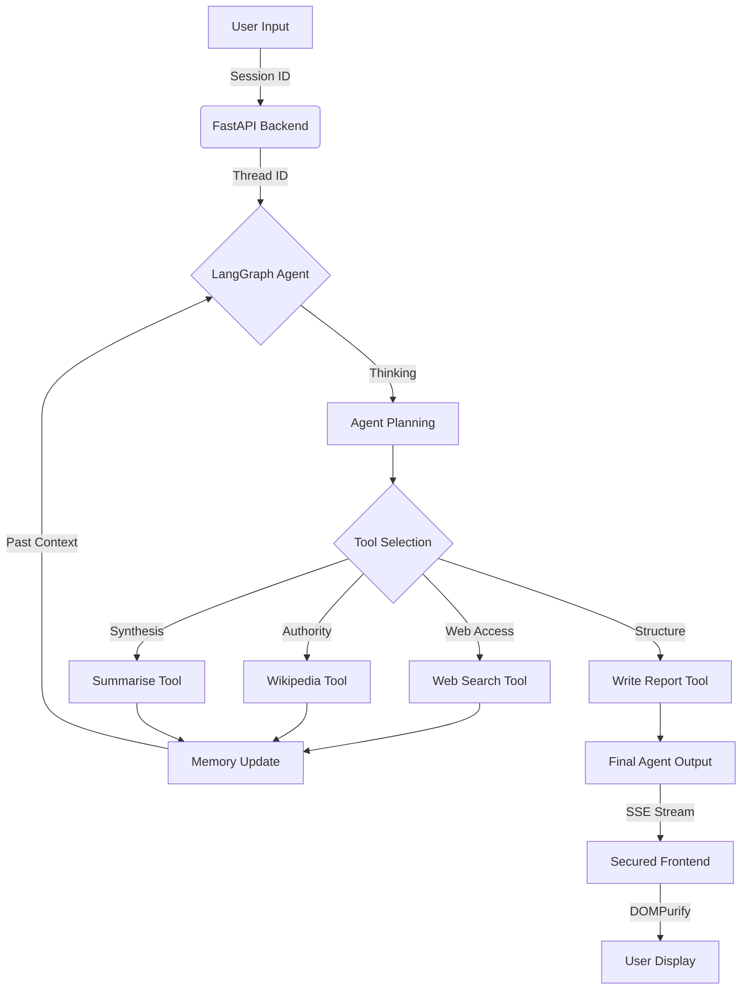

# 🛰️ TaskPilot-AI
### Full-Stack Autonomous Agentic Researcher

Welcome to **TaskPilot-AI**, a high-performance, autonomous AI task automator. This platform seamlessly integrates a premium dashboard with a robust LangGraph-powered AI agent, capable of real-time web research, data synthesis, and structured reporting.

---

## 🛠️ Tech Stack
*   **Frontend**: Vanilla HTML5, CSS3 (Modern Responsive Dashboard), JavaScript (SSE Streaming).
*   **Backend**: Python, FastAPI (Asynchronous Event Streaming).
*   **AI Framework**: LangGraph, LangChain (ReAct Agent Pattern).
*   **Intelligence**: Google Gemini 1.5 Flash API.
*   **Search**: `duckduckgo-search` & `wikipedia` (Multi-Source Autonomous Access).
*   **Security**: DOMPurify (Sanitised Markdown Rendering).

---

## 🌀 Autonomous Workflow
The flowchart below illustrates how TaskPilot-AI processes your "Mission Input" autonomously using real-time memory and tool interaction.



---

## 🚀 Advanced Features

### 🧠 Persistent AI Memory
Unlike standard AI chats, TaskPilot-AI utilizes **LangGraph's checkpointing system**. The agent remembers your name, previous tasks, and research context across multiple prompts within a single session.

### 🛑 Real-time Stop Control
Integrated `AbortController` functionality allowing users to instantly cancel a running agent mission if the task scope changes.

### 📥 Report Exporting
Instantly **Copy to Clipboard** or **Download as Markdown** directly from the dashboard. The reports are formatted for professional use with tables and bold headers.

### 📱 Premium Responsive UI
A fluid, modern dashboard designed for all screen sizes. Features a dynamic timeline with tool-specific icons (Search, Lookup, Synthesize).

### 🔒 Security-First Rendering
All AI reports are processed through **DOMPurify** before being rendered, ensuring zero risk of XSS or malicious code injection from hallucinated outputs.

---

## ⚙️ Setup & Installation

### 1. Requirements
*   Python 3.9+ or **Docker**
*   Google Gemini API Key ([Get one here](https://ai.google.dev))

### 2. Manual Installation
```bash
# Clone the repository
git clone https://github.com/avy2025/TaskPilotAI.git
cd TaskPilotAI

# Install dependencies
pip install -r requirements.txt
```

### 3. Docker Installation (Recommended)
```bash
# Start with one command
docker-compose up
```

### 4. Setup Environment
Create a `.env` file in the root directory:
```env
GEMINI_API_KEY=your_api_key_here
```

### 5. Run the Application (Manual)
```bash
python main.py
```
Open your browser at **[http://localhost:8000](http://localhost:8000)**.

---

## 📂 Project Structure
*   `main.py`: FastAPI server & SSE routing.
*   `agent.py`: LangGraph agent architecture & tool definitions.
*   `index.html`: Premium dashboard UI.
*   `style.css`: Responsive design system & animations.
*   `script.js`: SSE handling & UI state management.
*   `Dockerfile` & `docker-compose.yml`: Containerization logic.

---
*Created with ❤️ by the TaskPilot-AI Team.*
